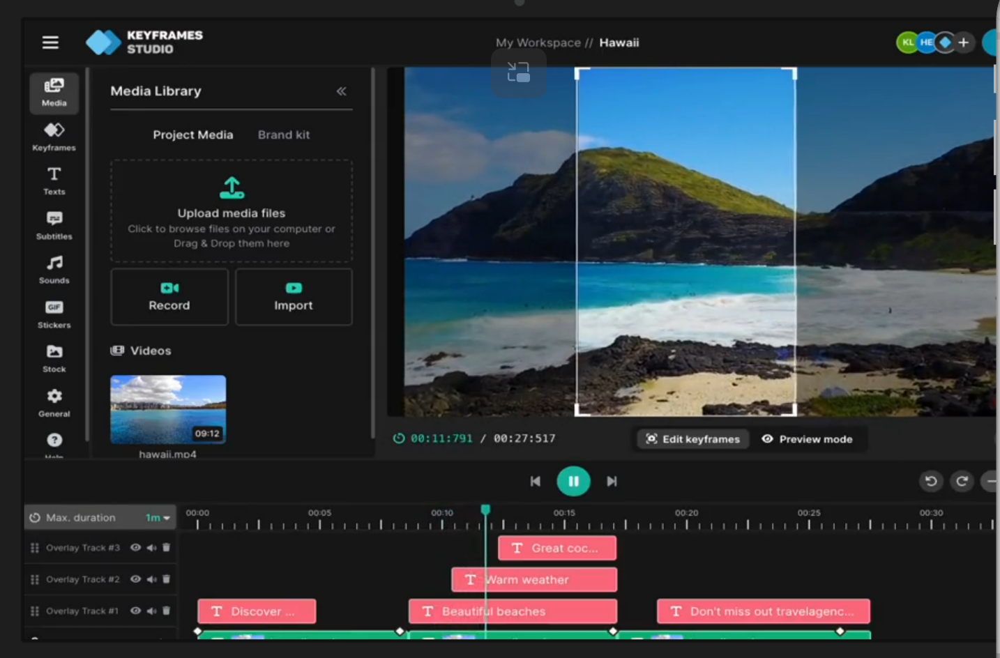

# Basic video editor requirements

## Overview
Build a browser-based video editor that starts from a user-uploaded video and provides core, lightweight editing tools. The editor must include a preview area and an export flow to download the processed video.

## Scope
- Web app (desktop-first, responsive for smaller screens)
- Single-user, local edits in the browser
- No authentication or cloud storage in this phase

## User flow
1. User opens the app and uploads a video to begin editing.
2. The video loads into the timeline and preview area.
3. The user performs edits (cut, add clips, merge, add text/shapes).
4. The user previews the result.
5. The user exports and downloads the processed video.

## Functional requirements
### Video input
- Support upload of common formats: MP4 (H.264/AAC), MOV, WebM.
- Show upload progress and validation errors for unsupported formats.
- Load the first uploaded video as the base clip on the timeline.

### Timeline and clip management
- Allow cutting a clip into multiple segments.
- Allow adding additional clips to the editor timeline.
- Allow rearranging clip order and merging sequential clips into a single output.
- Display clip durations and total timeline duration.

### Text overlays
- Allow adding text overlays to the video.
- Allow editing text content, font size, color, and position.
- Allow setting start and end times for text display.

### Shape overlays
- Allow adding basic shapes (rectangle, circle, line).
- Allow editing fill color, stroke color, stroke width, and position.
- Allow setting start and end times for shape display.

### Preview
- Provide a preview player that reflects timeline edits and overlays.
- Support play, pause, seek, and scrub through the timeline.
- Keep preview in sync with timeline changes.

### Export
- Provide an Export button that renders the edited timeline into a single video.
- Allow choosing output resolution (same as source, 720p, 1080p).
- Show export progress and allow download when complete.

## Technical requirements
- Use `ffmpeg.wasm` for client-side video processing and export.
- Use HTML5 `canvas` for rendering text and shape overlays in preview.
- Use `react-movable` for draggable overlay elements (text and shapes).
- Processing must remain in-browser (no server-side rendering).

## Non-functional requirements
- Reasonable performance for videos up to 5 minutes at 1080p.
- Clear error messaging for processing failures or unsupported inputs.
- Preserve video audio during cuts and merges.

## Out of scope (for this phase)
- Multi-track audio editing
- Transitions, filters, or effects beyond text and shapes
- Collaboration or cloud saves

## Acceptance criteria
- User can upload a video and see it in preview and timeline.
- User can cut the video, add additional clips, reorder them, and export a merged output.
- User can add text and shape overlays with position and timing controls.
- Exported file downloads successfully and matches the preview timeline.
- Design references: 
- 